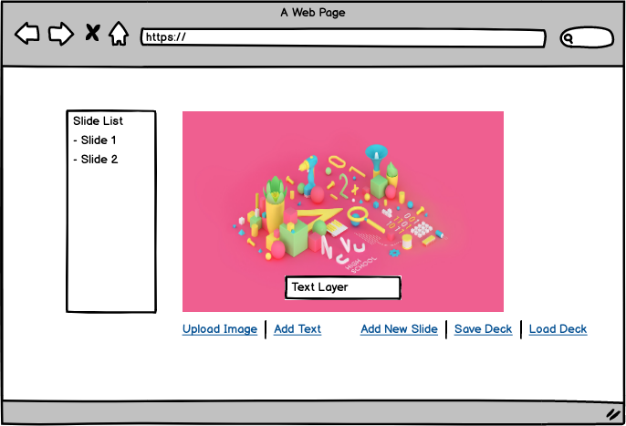

# Mini-project: Build a simple client-side presentation editor 

Main idea is to build a simplest version of a presentation editor (think Google Slides or slides.com). The tool should let the user select an image, add text on top of the image, add a new slide, save and load the slide deck. Details of each functionality is provided below.
 
Here is an example final screen for a such tool:

# TODO

Start with a blank page that has the following 5 links:

- **Upload Image**: Launch the file browser for user to select an image. Upon selection, display it on the page.
- **Add Text:** Show a dialog (javascript's prompt() is ok) to get text from the user and add that text on top of the image as layer. We should be able to drag the text across the image.
- **Add New Slide:**: Clear the screen and add a new empty slide. Update the slide list on the left.
- **Save Deck:** Store the current state of all slides. You can use localstorage.
- **Load Deck:** Load the saved deck from localstorage.

You can implement as many of the items as you want. You can use any libraries you want, but it is better if you can stick to plain javascript as much as you can. (We are using https://stimulusjs.org/ mainly, so bonus points if you use that, too) 

Host your code and running example somewhere public. (or send us the code and the instructions for how we can run it) We will be discussing your code and your architectural choices during the interview.
